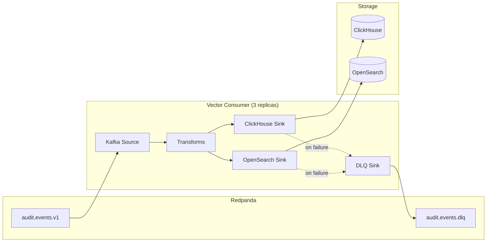

# Storage Pipeline - Architectural Design

## Overview
This document captures the architectural decisions for implementing the storage pipeline that consumes events from Redpanda and persists them to ClickHouse and OpenSearch.

## Architecture

## Design Decisions

### DD-1: Single Vector Deployment for Consumption
**Decision**: Use the same Vector deployment as a consumer (not a separate deployment).
**Rationale**: Vector supports both source and sink in the same config. Reduces operational complexity.
**Trade-off**: Tight coupling between ingestion and consumption. For MVP, this is acceptable.

### DD-2: Batching Strategy
| Store | Batch Size | Timeout | Rationale |
|-------|------------|---------|-----------|
| ClickHouse | 10,000 events | 5s | Optimized for columnar bulk inserts |
| OpenSearch | 5,000 docs | 5s | Bulk indexing API limits |

### DD-3: Consumer Group
**Decision**: Use a single consumer group `audit-consumer-group`.
**Rationale**: Ensures exactly-once processing semantics with Redpanda's transactional support.

### DD-4: Retry Strategy
- **Retries**: 3 attempts with exponential backoff (1s, 2s, 4s)
- **Circuit Breaker**: Open after 5 consecutive failures, half-open after 30s
- **DLQ**: Events failing all retries go to `audit.events.dlq`

### DD-5: OpenSearch Index Pattern
- **Pattern**: `audit-events-YYYY-MM-DD`
- **ISM Policy**: Hot (0-1 day) → Warm (1-7 days) → Delete (7+ days)
- **Force Merge**: After 1 day to optimize search

### DD-6: ClickHouse Table Engine
**Decision**: Use `ReplacingMergeTree` ordered by `(tenant_id, event_date, event_id)`.
**Rationale**: Supports deduplication and efficient partition pruning.

## Data Flow

1. Vector reads from `audit.events.v1` topic
2. Events are transformed (if needed)
3. Events are written to:
   - ClickHouse via HTTP bulk insert
   - OpenSearch via bulk index API
4. Failed events go to DLQ after retries exhausted

## Monitoring
- **Consumer Lag**: Prometheus metric `vector_kafka_consumer_lag`
- **Insert Rate**: `vector_sink_events_sent_total`
- **Error Rate**: `vector_sink_events_failed_total`
- **DLQ Size**: Redpanda topic offset difference
